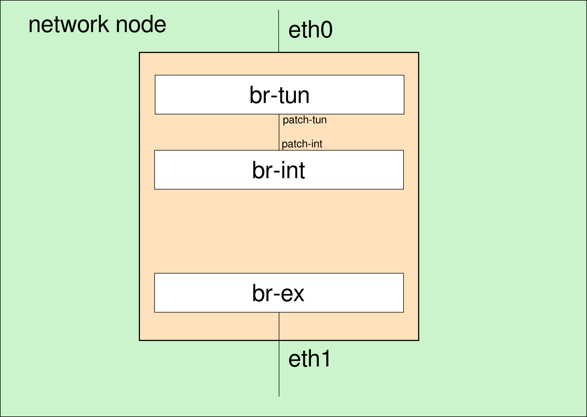
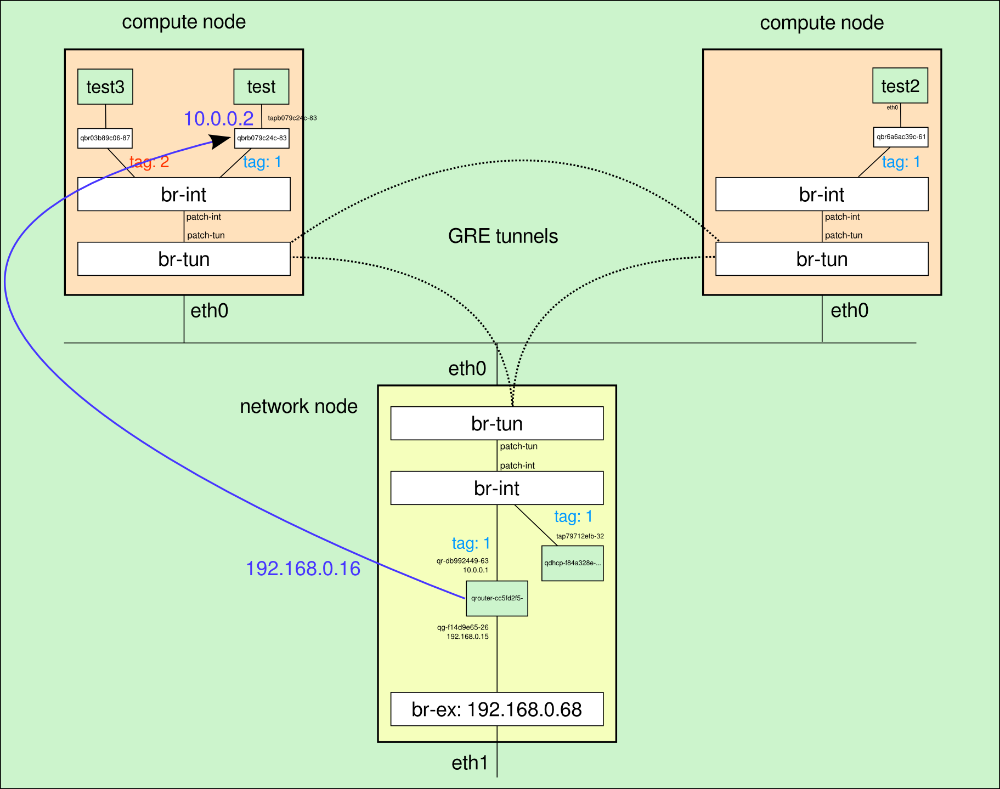

## Conexión con el exterior

En la sección anterior explicamos los mecanismos que permiten la conectividad
entre instancias que se ejecutan en diferentes nodos de computación, así como el
aislamiento entre diferentes redes privadas mediante VLAN. En esta sección vamos
a explicar de forma detallada el proceso que se sigue para conectar las
instancias con el exterior.

## Red externa

Supongamos que partimos de una situación inicial en la que tenemos el bridge
exterior ya creado en el nodo de red y la interfaz eth1 conectada a él:

    # ovs-ofctl show br-ex
    OFPT_FEATURES_REPLY (xid=0x2): dpid:000000270e035840
    n_tables:254, n_buffers:256
    capabilities: FLOW_STATS TABLE_STATS PORT_STATS QUEUE_STATS ARP_MATCH_IP
    actions: OUTPUT SET_VLAN_VID SET_VLAN_PCP STRIP_VLAN SET_DL_SRC SET_DL_DST
    SET_NW_SRC SET_NW_DST SET_NW_TOS SET_TP_SRC SET_TP_DST ENQUEUE
     1(eth1): addr:00:27:0e:ff:a8:41
          config:     0
	  state:      0			
	  current:    1GB-FD AUTO_NEG
	  advertised: 10MB-HD 10MB-FD 100MB-HD 100MB-FD 1GB-HD 1GB-FD COPPER AUTO_NEG AUTO_PAUSE AUTO_PAUSE_ASYM
	  supported:  10MB-HD 10MB-FD 100MB-HD 100MB-FD 1GB-HD 1GB-FD COPPER AUTO_NEG
     	  speed: 100 Mbps now, 1000 Mbps max
     LOCAL(br-ex): addr:00:27:0e:03:58:40
          config:     0
     	  state:      0
     	  speed: 0 Mbps now, 0 Mbps max
    OFPT_GET_CONFIG_REPLY (xid=0x4): frags=normal miss_send_len=0

Esta situación se representa esquemáticamente en la siguiente figura, en la que
puede observarse que el bridge exterior está conectado a la interfaz de red
física eth1 y desconectado de los otros dos bridges:

La dirección IP de br-ex es la 192.168.0.68 y está en una red 192.168.0.0/24 del
que podemos utilizar el rango 192.168.0.15-192.168.0.45 como direcciones IP
flotantes.

Creamos como administrador de neutron una red externa:

	# neutron net-create ext_net -- --router:external=True
	Created a new network:
	+---------------------------+--------------------------------------+
	| Field                     | Value                                |
	+---------------------------+--------------------------------------+
	| admin_state_up            | True                                 |
	| id                        | 3292768d-b916-45bc-8ce5-cbab121d6d01 |
	| name                      | ext_net                              |
	| provider:network_type     | gre                                  |
	| provider:physical_network |                                      |
	| provider:segmentation_id  | 3                                    |
	| router:external           | True                                 |
	| shared                    | False                                |
	| status                    | ACTIVE                               |
	| subnets                   |                                      |
	| tenant_id                 | 635dd2732ceb468e8518e556248c23d0     |
	+---------------------------+--------------------------------------+

Y asociamos una subred en la que especificamos el depósito de IP asignables:

	# neutron subnet-create --allocation-pool \
	start=192.168.0.15,end=192.168.0.45 ext_net 192.168.0.0/24 -- \
	--enable_dhcp=False
	Created a new subnet:
	+------------------+--------------------------------------------------+
	| Field            | Value                                            |
	+------------------+--------------------------------------------------+
	| allocation_pools | {"start": "192.168.0.15", "end": "192.168.0.45"} |
	| cidr             | 192.168.0.0/24                                   |
	| dns_nameservers  |                                                  |
	| enable_dhcp      | False                                            |
	| gateway_ip       | 192.168.0.1                                      |
	| host_routes      |                                                  |
	| id               | be85bfa6-6dd5-4b59-bdce-614e669c9f3e             |
	| ip_version       | 4                                                |
	| name             |                                                  |
	| network_id       | 3292768d-b916-45bc-8ce5-cbab121d6d01             |
	| tenant_id        | 635dd2732ceb468e8518e556248c23d0                 |
	+------------------+--------------------------------------------------+

Podemos entrar ahora en horizon con un usuario cualquiera y podemos observar en
"Topología de red" que ha aparecido una nueva red no gestionada por el usuario

Tenemos por un lado redes privadas gestionadas por cada proyecto y una red
exterior gestionada por el administrador, ¿qué elemento de red nos hace falta
ahora para poder conectar las redes privadas con la red exterior? 

## Routers

En el despliegue de OpenStack que estamos utilizando cada proyecto puede definir
sus propias redes privadas y routers, estos routers son los dispositivos que
permiten conectar las redes privadas con la red exterior y realmente lo que van
a hacer es conectar el bridge exterior con el bridge de integración.

Como usuario normal, definimos un nuevo router para conectar la red privada con
el exterior:

	$ neutron router-create r1
	Created a new router:
	+-----------------------+--------------------------------------+
	| Field                 | Value                                |
	+-----------------------+--------------------------------------+
	| admin_state_up        | True                                 |
	| external_gateway_info |                                      |
	| id                    | cc5fd2f5-59d6-484d-a759-819917a5610c |
	| name                  | r1                                   |
	| status                | ACTIVE                               |
	| tenant_id             | 4beb810ce40f49659e0bca732e4f1a3c     |
	+-----------------------+--------------------------------------+

### Conexión a la red exterior

Conectamos el router a la red exterior, lo que se denomina en neutron configurar
la puerta de enlace:

	$ neutron router-gateway-set cc5fd2f5-59d6-484d-a759-819917a5610c \
	3292768d-b916-45bc-8ce5-cbab121d6d01
	Set gateway for router cc5fd2f5-59d6-484d-a759-819917a5610c

Los routers también se crean en un espacio de nombres de red propio, por lo que
podemos comprobar con la instrucción *ip netns* que aparece un nuevo espacio de
nombres:

	# ip netns |grep cc5fd2f5-59d6-484d-a759-819917a5610c
	qrouter-cc5fd2f5-59d6-484d-a759-819917a5610c

Si vemos las direcciones IP de las interfaces de red en ese espacio de nombres,
comprobaremos que existe una interfaz de red con el prefijo "qj-" y de nuevo 11
caracteres asociados al nuevo puerto creado:

	# ip netns exec qrouter-cc5fd2f5-59d6-484d-a759-819917a5610c ip addr show
	27: lo: <LOOPBACK,UP,LOWER_UP> mtu 16436 qdisc noqueue state UNKNOWN 
	    link/loopback 00:00:00:00:00:00 brd 00:00:00:00:00:00
        inet 127.0.0.1/8 scope host lo
	    inet6 ::1/128 scope host 
	       valid_lft forever preferred_lft forever
	28: qg-f14d9e65-26: <BROADCAST,UP,LOWER_UP> mtu 1500 qdisc noqueue state UNKNOWN 
	    link/ether fa:16:3e:b8:0a:f9 brd ff:ff:ff:ff:ff:ff
        inet 192.168.0.15/24 brd 192.168.0.255 scope global qg-f14d9e65-26
        inet6 fe80::f816:3eff:feb8:af9/64 scope link 
           valid_lft forever preferred_lft forever

Si comprobamos con las credenciales del administrador del cloud los puertos,
veremos que aparece un nuevo puerto asociado a la primera dirección IP de
nuestra red exterior (192.168.0.15):

	# neutron port-list|grep 192.168.0.15

	| f14d9e65-2608-4b1c-b17d-58c59ce84e8a |      | fa:16:3e:b8:0a:f9 | {"subnet_id": "be85bfa6-6dd5-4b59-bdce-614e669c9f3e", "ip_address": "192.168.0.15"} |

Desde cualquier equipo de la red exterior al que está conectado el nodo de red
podemos comprobar que tenemos conexión con el router recién creado:

	$ ping -c 3 192.168.0.15
	PING 192.168.0.15 (192.168.0.15) 56(84) bytes of data.
	64 bytes from 192.168.0.15: icmp_req=1 ttl=64 time=0.517 ms
	64 bytes from 192.168.0.15: icmp_req=2 ttl=64 time=0.163 ms
	64 bytes from 192.168.0.15: icmp_req=3 ttl=64 time=0.175 ms
	
	--- 192.168.0.15 ping statistics ---
	3 packets transmitted, 3 received, 0% packet loss, time 1998ms
	rtt min/avg/max/mdev = 0.163/0.285/0.517/0.164 ms

### Conexión a la red privada

Conectamos el router a la red privada (es necesario conocer el id de la subred)
mediante la instrucción:

    $ neutron router-interface-add cc5fd2f5-59d6-484d-a759-819917a5610c d4bb2d0e-2af7-44fe-9729-4e3b95766e28
	Added interface db992449-635f-4267-9d53-3ddb24a9acc1 to router cc5fd2f5-59d6-484d-a759-819917a5610c.

Y podremos comprobar que se ha creado un nuevo puerto en el proyecto asociado a
la dirección IP 10.0.0.1 (por defecto se reserva esta dirección IP en cada
subred para el router):

    $ neutron port-list
	+--------------------------------------+------+-------------------+---------------------------------------------------------------------------------+
	| id                                   | name | mac_address       | fixed_ips
	|
	+--------------------------------------+------+-------------------+---------------------------------------------------------------------------------+
    ...
    | db992449-635f-4267-9d53-3ddb24a9acc1 |      | fa:16:3e:6b:cf:fa |
	{"subnet_id": "d4bb2d0e-2af7-44fe-9729-4e3b95766e28", "ip_address": "10.0.0.1"}
	|
	+--------------------------------------+------+-------------------+---------------------------------------------------------------------------------+
	
En el espacio de nombres del router aparece una nueva interfaz de red asociada a
este puerto con la dirección IP 10.0.0.1:

    # ip netns exec qrouter-cc5fd2f5-59d6-484d-a759-819917a5610c ip addr show
	...
    29: qr-db992449-63: <BROADCAST,UP,LOWER_UP> mtu 1500 qdisc noqueue state UNKNOWN 
    link/ether fa:16:3e:6b:cf:fa brd ff:ff:ff:ff:ff:ff
    inet 10.0.0.1/24 brd 10.0.0.255 scope global qr-db992449-63
    inet6 fe80::f816:3eff:fe6b:cffa/64 scope link 
       valid_lft forever preferred_lft forever
					   
La denominación de la interfaz sigue el mismo criterio que en casos anteriores,
aunque en este caso se utiliza el prefijo "qr-" y posteriormente los 11 primeros
caracteres del puerto con el que se relaciona.

Esta interfaz de red está conectada al bridge de integración, como puede
verificarse mediante:

    # ovs-ofctl show br-int|grep qr-db992449-63
	8(qr-db992449-63): addr:7d:02:00:00:00:00

Puesto que tenemos una regla de seguridad que permite todo el protocolo ICMP
entre los equipos de la red 10.0.0.0/24, podemos hacer ping desde el router a la
instancia:

    # ip netns exec qrouter-cc5fd2f5-59d6-484d-a759-819917a5610c ping 10.0.0.2
	PING 10.0.0.2 (10.0.0.2) 56(84) bytes of data.
	64 bytes from 10.0.0.2: icmp_seq=1 ttl=64 time=0.378 ms
	...

OpenStack neutron añade automáticamente una regla de SNAT para que las
instancias de la red privada puedan acceder al exterior utilizando la dirección
IP exterior del router:

    # ip netns exec qrouter-cc5fd2f5-59d6-484d-a759-819917a5610c iptables -t nat -S|grep SNAT
    -A neutron-l3-agent-snat -s 10.0.0.0/24 -j SNAT --to-source 192.168.0.15 

Es decir, todas las máquinas de la red privada pueden acceder al exterior aunque
todavía no tengan asociada una dirección IP flotante. Las IPs flotantes se
utilizan para poder iniciar una conexión desde el exterior a una instancia
completa, por lo que se utilizan reglas de DNAT de iptables.

### IP flotante

Las IP flotantes se definen como las direcciones IPs asociadas a la red
exterior, que en un momento determinado se relacionan con una instancia y con su
dirección IP fija, pero que pueden relacionarse con otra instancia cuando se
desee. Las IPs flotantes permiten que las instancias sean accesibles desde el
exterior.

Solicitamos la asignación de una IP flotante al proyecto:

    $ neutron floatingip-create ext_net
	Created a new floatingip:
	+---------------------+--------------------------------------+
	| Field               | Value                                |
	+---------------------+--------------------------------------+
	| fixed_ip_address    |                                      |
	| floating_ip_address | 192.168.0.16                         |
	| floating_network_id | 3292768d-b916-45bc-8ce5-cbab121d6d01 |
	| id                  | bd31743b-79df-41a4-a40c-62756e868a88 |
	| port_id             |                                      |
	| router_id           |                                      |
	| tenant_id           | 4beb810ce40f49659e0bca732e4f1a3c     |
	+---------------------+--------------------------------------+

La IP flotante se asocia a un determinado puerto (en este caso al de la máquina
test) mediante:

    $ neutron floatingip-associate bd31743b-79df-41a4-a40c-62756e868a88 b079c24c-8386-47db-a730-35b3a99419e8
	Associated floatingip bd31743b-79df-41a4-a40c-62756e868a88

Si ahora vemos las reglas de la tabla nat de iptables en el espacio de nombres
del router observaremos las reglas de DNAT asociadas a la IP flotante 192.168.0.16:

    # ip netns exec qrouter-cc5fd2f5-59d6-484d-a759-819917a5610c iptables -t nat -S
	...
	-A neutron-l3-agent-OUTPUT -d 192.168.0.16/32 -j DNAT --to-destination 10.0.0.2 
	...
	-A neutron-l3-agent-PREROUTING -d 192.168.0.16/32 -j DNAT --to-destination 10.0.0.2 
	
Creamos reglas de seguridad para poder acceder a la instancia por ssh desde la
red 192.168.0.0/24:

    $ neutron security-group-rule-create --direction ingress --protocol tcp --port-range-min 22 --port-range-max 22 --remote-ip-prefix 192.168.0.0/24 default
	
Que lógicamente se relaciona con una nueva regla de cortafuegos que se crea en
la cadena ib079c24c-8 de la interfaz de red tapb079c24c-83 de la instancia
"test" en el nodo de computación:

    # iptables -S|grep ib079c24c-8
	...
	-A neutron-openvswi-ib079c24c-8 -s 192.168.0.0/24 -p tcp -m tcp --dport 22 -j RETURN 
	
Finalmente podemos ver la situación generada con todas sus interfaces de red y
direcciones IP en el siguiente diagrama:

