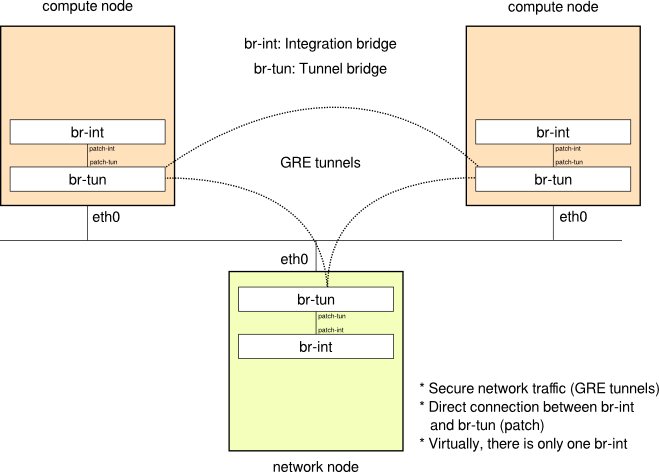
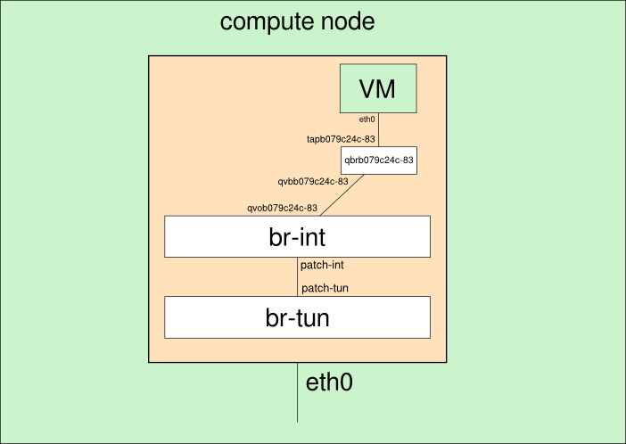
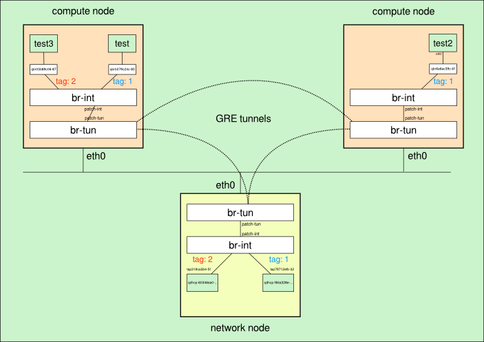

## Redes privadas

Puesto que el despliegue completo incluye muchos elementos y puede resultar
demasiado complejo, vamos a tratar en esta sección el funcionamiento interno de
las redes privadas y en la siguiente sección veremos cómo se conectan al
exterior.

## Bridge de integración y túneles GRE

El objetivo a la hora de utilizar virtualización de redes es conseguir que las
instancias de una misma red se comuniquen entre sí utilizando el mismo
direccionamiento y compartiendo algunos elementos comunies (servidor DHCP,
puerta de enlace, etc.), pero que permenezcan completamente separadas del resto
de redes virtuales. Esto debe producirse independientemente del hipervisor (nodo
de computación) en el que se estén ejecutando las máquinas virtuales y una de
las formas de conseguir esto con OpenvSwitch es crear un switch virtual en cada
nodo, que se denomina switch de integración o br-int y comunicar cada nodo con
los demás a través de túneles GRE, que garantizan la seguridad de las
comunicaciones entre nodos.

Un esquema que representa esta situación tras una instalación limpia de
OpenStack neutron en cualquiera de los escenarios de prueba se ve en la
siguiente imagen:

### Verificación inicial

Puesto que vamos a ir mostrando paso a paso cómo se van creando algunos bridges
y puertos de conexión, vamos a mostrar cual es la situación de partida.

Inicialmente no hay ningún bridge linux:

	# brctl show
	bridge name	bridge id		STP enabled	interfaces

En el nodo de red hay tres puentes Open vSwitch (br-int, br-tun y br-ex). En
este apartado trabajaremos con el bridge de integración (br-int) y el bridge
para los túneles (br-tun):

	# ovs-vsctl list-br
	br-ex
	br-int
	br-tun

Esa misma salida en un nodo de computación, muestra que hay dos bridges Open
vSwitch:

	# ovs-vsctl list-br
	br-int
	br-tun

El único dispositivo conectado inicialmente a br-int es br-tun a través de una
interfaz especial denominada puerto patch:

	# ovs-ofctl show br-int
	OFPT_FEATURES_REPLY (xid=0x2): dpid:000032e2b607a841
	n_tables:254, n_buffers:256
	capabilities: FLOW_STATS TABLE_STATS PORT_STATS QUEUE_STATS ARP_MATCH_IP
	actions: OUTPUT SET_VLAN_VID SET_VLAN_PCP STRIP_VLAN SET_DL_SRC SET_D...
	 1(patch-tun): addr:fa:82:c1:68:15:38
	     config:     0
	     state:      0
	     speed: 0 Mbps now, 0 Mbps max
	 LOCAL(br-int): addr:32:e2:b6:07:a8:41
	     config:     0
	     state:      0
	     speed: 0 Mbps now, 0 Mbps max
	OFPT_GET_CONFIG_REPLY (xid=0x4): frags=normal miss_send_len=0

En el caso de br-tun existe un puerto para cada túnel GRE:

	# ovs-ofctl show br-tun
	OFPT_FEATURES_REPLY (xid=0x2): dpid:0000d2c93b314b42
	n_tables:254, n_buffers:256
	capabilities: FLOW_STATS TABLE_STATS PORT_STATS QUEUE_STATS ARP_MATCH_IP
	actions: OUTPUT SET_VLAN_VID SET_VLAN_PCP STRIP_VLAN SET_DL_SRC SET_DL_DST
	SET_NW_SRC SET_NW_DST SET_NW_TOS SET_TP_SRC SET_TP_DST ENQUEUE
	 1(patch-int): addr:56:63:30:9a:59:a7
	      config:     0
	      state:      0
	      speed: 0 Mbps now, 0 Mbps max
	 2(gre-1): addr:26:7c:0f:93:22:ee
	      config:     0
	      state:      0
	      speed: 0 Mbps now, 0 Mbps max
	 3(gre-2): addr:26:7c:0f:a3:12:ae
	      config:     0
	      state:      0
	      speed: 0 Mbps now, 0 Mbps max
	 LOCAL(br-tun): addr:d2:c9:3b:31:4b:42
	      config:     0
	      state:      0
	      speed: 0 Mbps now, 0 Mbps max
	OFPT_GET_CONFIG_REPLY (xid=0x4): frags=normal miss_send_len=0

### Creación de una red privada

Utilizando el cliente de línea de comandos de neutron y con las credenciales de
un usuario normal, creamos una red privada y una subred asociada a ella con el
rango de direcciones IP 10.0.0.0/24:

	$ neutron net-create privada
	Created a new network:
	+----------------+--------------------------------------+
	| Field          | Value                                |
	+----------------+--------------------------------------+
	| admin_state_up | True                                 |
	| id             | f84a328e-407e-4ca6-87bb-ec148853c585 |
	| name           | privada                              |
	| shared         | False                                |
	| status         | ACTIVE                               |
	| subnets        |                                      |
	| tenant_id      | 4beb810ce40f49659e0bca732e4f1a3c     |
	+----------------+--------------------------------------+

	$ neutron subnet-create f84a328e-407e-4ca6-87bb-ec148853c585 10.0.0.0/24
	Created a new subnet:
	+------------------+--------------------------------------------+
	| Field            | Value                                      |
	+------------------+--------------------------------------------+
	| allocation_pools | {"start": "10.0.0.2", "end": "10.0.0.254"} |
	| cidr             | 10.0.0.0/24                                |
	| dns_nameservers  |                                            |
	| enable_dhcp      | True                                       |
	| gateway_ip       | 10.0.0.1                                   |
	| host_routes      |                                            |
	| id               | d4bb2d0e-2af7-44fe-9729-4e3b95766e28       |
	| ip_version       | 4                                          |
	| name             |                                            |
	| network_id       | f84a328e-407e-4ca6-87bb-ec148853c585       |
	| tenant_id        | 4beb810ce40f49659e0bca732e4f1a3c           |
	+------------------+--------------------------------------------+

### Creación automática de la red virtual al levantar una instancia:

La red anteriormente definida no se crea realmente hasta que no se lance una
instancia, para la cual se crean todos los dispositivos de red necesarios y se
interconectan adecuadamente:

	$ nova boot --image 4ddb27ab-b3cc-4a65-ac52-f4ce7894e4ed \
	--flavor 1 \
	--key_name clave-openstack \
	--nic net-id=f84a328e-407e-4ca6-87bb-ec148853c585 \
	test

Comprobamos que aparecen un nuevo puerto en el br-int del nodo de red:

	# ovs-ofctl show br-int
	...
	 2(tap79712efb-32): addr:30:02:00:00:00:00
	     config:     PORT_DOWN
	     state:      LINK_DOWN
	     speed: 0 Mbps now, 0 Mbps max
	...

y un nuevo puerto en el nodo de computación:

	# ovs-ofctl show br-int
	...
	 2(qvob079c24c-83): addr:ae:49:25:f2:4a:1c
	     config:     0
	     state:      0
	     current:    10GB-FD COPPER
	     speed: 10000 Mbps now, 0 Mbps max
	...

Y vemos que se etiqueta automáticamente ambos nodos en una misma VLAN con el
número 1, tanto en el nodo de red:

	# ovs-vsctl show
	...
	        Port "tap79712efb-32"
	            tag: 1
	            Interface "tap79712efb-32"
	                type: internal
	...

Como en el nodo de computación:

	# ovs-vsctl show
	...
	    Bridge br-int
	        Port "qvob079c24c-83"
	            tag: 1
	            Interface "qvob079c24c-83"
	...

Para entender la numeración que utiliza neutron para los nuevos puertos y los
pasos que se siguen, vamos a ver en primer lugar los nuevos puertos que aparecen
en el proyecto (estos puertos son los que el usuario del proyecto puede ver):

	$ neutron port-list
	+--------------------------------------+------+-------------------+---------------------------------------------------------------------------------+
	| id                                   | name | mac_address       | fixed_ips                                                                       |
	+--------------------------------------+------+-------------------+---------------------------------------------------------------------------------+
	| 79712efb-320d-407d-82d7-eafd7eb51abe |      | fa:16:3e:dd:ff:a4 | {"subnet_id": "d4bb2d0e-2af7-44fe-9729-4e3b95766e28", "ip_address": "10.0.0.3"} |
	| b079c24c-8386-47db-a730-35b3a99419e8 |      | fa:16:3e:79:3b:ac | {"subnet_id": "d4bb2d0e-2af7-44fe-9729-4e3b95766e28", "ip_address": "10.0.0.2"} |
	+--------------------------------------+------+-------------------+---------------------------------------------------------------------------------+

El que tiene la dirección IP 10.0.0.3 se corresponde con un servidor DHCP que se ha 
creado (que veremos más adelante), el que tiene la dirección IP 10.0.0.2 se
corresponde con la máquina que hemos creado, por lo que nos quedamos con su uuid:

	 b079c24c-8386-47db-a730-35b3a99419e8

Como se tienen que crear varias interfaces de red asociadas a este puerto y el UUID es 
demasiado largo, neutron opta por utilizar solo los 11 primeros caracteres
(b079c24c-83).

Podemos comprobar que en el nodo de computación en el que se está ejecutando la
instancia aparecen 4 interfaces de red nuevas relacionadas con el identificador
b079c24c-83:

	# ip link show|grep qbrb079c24c-83
	13: qbrb079c24c-83: <BROADCAST,MULTICAST,UP,LOWER_UP> mtu 1500 qdisc noqueue state UNKNOWN 
	14: qvob079c24c-83: <BROADCAST,MULTICAST,PROMISC,UP,LOWER_UP> mtu 1500 qdisc pfifo_fast state UP qlen 1000
	15: qvbb079c24c-83: <BROADCAST,MULTICAST,PROMISC,UP,LOWER_UP> mtu 1500 qdisc pfifo_fast state UP qlen 1000
	16: tapb079c24c-83: <BROADCAST,MULTICAST,UP,LOWER_UP> mtu 1500 qdisc pfifo_fast state UNKNOWN qlen 500

La forma en la que se interconectan todas estas interfaces se muestra en la siguiente
 imagen y es necesario añadir un bridge linux por cada instancia por la forma de definir
las reglas de seguridad por instancia:

	qbr: Linux bridge
	qvo: Puerto en br-int
	qvb: Puerto en linux bridge
	tap: Interfaz de red de la máquina

Esto es algo que choca bastante al principio y hace más difícil entender los
elementos implicados, pero parece ser que existe una incompatibilidad
actualmente entre la utilización de Open vSwitch, iptables e interfaces tap, tal
como se explica en <a
href="http://docs.openstack.org/admin-guide-cloud/content/under_the_hood_openvswitch.html">OpenStack
Cloud Administration Guide</a>: *Ideally, the TAP device vnet0 would be
connected directly to the integration bridge, br-int. Unfortunately, this isn't
possible because of how OpenStack security groups are currently
implemented. OpenStack uses iptables rules on the TAP devices such as vnet0 to
implement security groups, and Open vSwitch is not compatible with iptables
rules that are applied directly on TAP devices that are connected to an Open
vSwitch port.*

Comprobamos el nuevo bridge linux que se ha creado con las interfaces tapb079c24c-83 
y qvbb079c24c-83

	# brctl show qbrb079c24c-83
	bridge name	bridge id		STP enabled	interfaces
	qbrb079c24c-83		8000.dea164299d40	no		qvbb079c24c-83
									tapb079c24c-83

### Servidor DHCP

Se utiliza linux network namespaces, un modo de virtualización de la red

En el nodo de red ejecutamos la instrucción:

	# ip netns
	qdhcp-f84a328e-407e-4ca6-87bb-ec148853c585

Vemos que se ha creado un espacio de nombres que empieza por dhcp, podemos ejecutar 
comandos en ese espacio de nombres de forma independiente del sistema:

	# ip netns exec qdhcp-f84a328e-407e-4ca6-87bb-ec148853c585 ip link show
	11: tap79712efb-32: <BROADCAST,UP,LOWER_UP> mtu 1500 qdisc noqueue state UNKNOWN 
	    link/ether fa:16:3e:dd:ff:a4 brd ff:ff:ff:ff:ff:ff
	12: lo: <LOOPBACK,UP,LOWER_UP> mtu 16436 qdisc noqueue state UNKNOWN 
	    link/loopback 00:00:00:00:00:00 brd 00:00:00:00:00:00

Comprobamos que el dispositivo tap79712efb-32 está definido en este espacio de nombres.

Podemos ver también el proceso DHCP (con dnsmasq) que se está ejecutando en el
nodo de red  para darle IP dinámica a las instancias:

	# ps aux|grep f84a328e-407e-4ca6-87bb-ec148853c585
	nobody   19821  0.0  0.0  12888   652 ?        S    10:15   0:00 dnsmasq --no-hosts --no-resolv --strict-order --bind-interfaces --interface=tap79712efb-32 --except-interface=lo --pid-file=/var/lib/neutron/dhcp/f84a328e-407e-4ca6-87bb-ec148853c585/pid --dhcp-hostsfile=/var/lib/neutron/dhcp/f84a328e-407e-4ca6-87bb-ec148853c585/host --dhcp-optsfile=/var/lib/neutron/dhcp/f84a328e-407e-4ca6-87bb-ec148853c585/opts --leasefile-ro --dhcp-range=tag0,10.0.0.0,static,86400s --dhcp-lease-max=256 --conf-file= --domain=openstacklocal

Hay que destacar que la instrucción anterior incluye el parámetro "--no-resolv"
por lo que no se utilizará el fichero /etc/resolv.conf de la máquina donde se
ejecuta dnsmasq para definir los servidores DNS en los clientes DHCP. Esto
quiere decir que habrá que definir de forma explícita estos servidores DNS en
cada subred privada.

Podemos acceder al directorio:

	# cd /var/lib/neutron/dhcp/f84a328e-407e-4ca6-87bb-ec148853c585

Y comprobar que existe una reserva para la MAC de la instancia:

	# cat /var/lib/neutron/dhcp/f84a328e-407e-4ca6-87bb-ec148853c585/host 
	fa:16:3e:79:3b:ac,host-10-0-0-2.openstacklocal,10.0.0.2

### Conexión con otra instancia de la misma red

Para comprobar la conectividad entre instancias dentro de una misma red privada,
creamos una nueva instancia (test2) que se ejecutará en el segundo nodo de
computación y que virtualmente está en la misma red privada que la instancia
"test", aunque todo el tráfico pase por el bridge de integración de cada nodo de
computación, el bridge túnel y el túnel GRE.

Si listamos los puertos del proyecto al crear la nueva instancia, veremos que
aparece un puerto nuevo:

	$ neutron port-list
	+--------------------------------------+------+-------------------+---------------------------------------------------------------------------------+
	| id                                   | name | mac_address       | fixed_ips                                                                       |
	+--------------------------------------+------+-------------------+---------------------------------------------------------------------------------+
	| 6a6ac39c-61fb-46a5-bd39-e8ba1701d103 |      | fa:16:3e:eb:2c:d3 | {"subnet_id": "d4bb2d0e-2af7-44fe-9729-4e3b95766e28", "ip_address": "10.0.0.4"} |
	...

Luego tiene que haber nuevas interfaces de red en el segundo nodo de computación:

	# ip link show|grep 6a6ac39c-61
	17: qbr6a6ac39c-61: <BROADCAST,MULTICAST,UP,LOWER_UP> mtu 1500 qdisc noqueue state UNKNOWN 
	18: qvo6a6ac39c-61: <BROADCAST,MULTICAST,PROMISC,UP,LOWER_UP> mtu 1500 qdisc pfifo_fast state UP qlen 1000
	19: qvb6a6ac39c-61: <BROADCAST,MULTICAST,PROMISC,UP,LOWER_UP> mtu 1500 qdisc pfifo_fast state UP qlen 1000
	20: tap6a6ac39c-61: <BROADCAST,MULTICAST,UP,LOWER_UP> mtu 1500 qdisc pfifo_fast state UNKNOWN qlen 500

Siguiendo el esquema de trabajo de la primera imagen, esta instancia se ha
creado en el segundo nodo de computación, por lo que comprobamos que
qvo6a6ac39c-61 está conectado a br-int:

	# ovs-ofctl show br-int
	...
	 2(qvo6a6ac39c-61): addr:0e:7e:7b:30:4a:bc
	     config:     0
	     state:      0
	     current:    10GB-FD COPPER
	     speed: 10000 Mbps now, 0 Mbps max
	...

Y vemos el nuevo bridge linux:

	# brctl show qbr6a6ac39c-61
	bridge name	bridge id		STP enabled	interfaces
	qbr6a6ac39c-61		8000.96a4ec71dea6	no		qvb6a6ac39c-61
									tap6a6ac39c-61

#### Reglas del grupo de seguridad

Comprobamos las reglas de iptables que se han creado en el nodo de computación
al levantar la instancia test (b079c24c-8386-47db-a730-35b3a99419e8), en este
caso se crean reglas utilizando sólo los 10 primeros caracteres del uuid: 

	# iptables -S |grep b079c24c-8 
	-N neutron-openvswi-ib079c24c-8
	-N neutron-openvswi-ob079c24c-8
	-N neutron-openvswi-sb079c24c-8
	-A neutron-openvswi-FORWARD -m physdev --physdev-out tapb079c24c-83 --physdev-is-bridged -j neutron-openvswi-sg-chain 
	-A neutron-openvswi-FORWARD -m physdev --physdev-in tapb079c24c-83 --physdev-is-bridged -j neutron-openvswi-sg-chain 
	-A neutron-openvswi-INPUT -m physdev --physdev-in tapb079c24c-83 --physdev-is-bridged -j neutron-openvswi-ob079c24c-8 
	-A neutron-openvswi-ib079c24c-8 -m state --state INVALID -j DROP 
	-A neutron-openvswi-ib079c24c-8 -m state --state RELATED,ESTABLISHED -j RETURN 
	-A neutron-openvswi-ib079c24c-8 -s 10.0.0.3/32 -p udp -m udp --sport 67 --dport 68 -j RETURN 
	-A neutron-openvswi-ib079c24c-8 -j neutron-openvswi-sg-fallback 
	-A neutron-openvswi-ob079c24c-8 -p udp -m udp --sport 68 --dport 67 -j RETURN 
	-A neutron-openvswi-ob079c24c-8 -j neutron-openvswi-sb079c24c-8 
	-A neutron-openvswi-ob079c24c-8 -p udp -m udp --sport 67 --dport 68 -j DROP 
	-A neutron-openvswi-ob079c24c-8 -m state --state INVALID -j DROP 
	-A neutron-openvswi-ob079c24c-8 -m state --state RELATED,ESTABLISHED -j RETURN 
	-A neutron-openvswi-ob079c24c-8 -j neutron-openvswi-sg-fallback 
	-A neutron-openvswi-sb079c24c-8 -s 10.0.0.2/32 -m mac --mac-source FA:16:3E:79:3B:AC -j RETURN 
	-A neutron-openvswi-sb079c24c-8 -j DROP 
	-A neutron-openvswi-sg-chain -m physdev --physdev-out tapb079c24c-83 --physdev-is-bridged -j neutron-openvswi-ib079c24c-8 
	-A neutron-openvswi-sg-chain -m physdev --physdev-in tapb079c24c-83 --physdev-is-bridged -j neutron-openvswi-ob079c24c-8 

Entre las que destacamos las siguientes:

* Se crean tres nuevas cadenas, para los procesos de entrada (i), salida (o) y prevenir spoofing (s):

	-N neutron-openvswi-ib079c24c-8
	-N neutron-openvswi-ob079c24c-8
	-N neutron-openvswi-sb079c24c-8

* Se permiten conexiones entrantes relacionadas o establecidas:

	-A neutron-openvswi-ib079c24c-8 -m state --state RELATED,ESTABLISHED -j RETURN 

* Se permiten las respuestas DHCP (DHCPOFFER y DHCPACK) desde el servidor DHCP de la red:

	-A neutron-openvswi-ib079c24c-8 -s 10.0.0.3/32 -p udp -m udp --sport 67 --dport 68 -j RETURN 

* Se permiten peticiones DHCP (DHCPDISCOVER y DHCPREQUEST):

	-A neutron-openvswi-ob079c24c-8 -p udp -m udp --sport 68 --dport 67 -j RETURN 

* Se permiten conexiones salientes relacionadas o establecidas:

	-A neutron-openvswi-ob079c24c-8 -m state --state RELATED,ESTABLISHED -j RETURN 

* Se verifica la correspondencia entre la dirección IP y la MAC:

	-A neutron-openvswi-sb079c24c-8 -s 10.0.0.2/32 -m mac --mac-source FA:16:3E:79:3B:AC -j RETURN 

#### Conectividad entre las instancias de la misma red

Como las reglas de cortafuegos se aplican a las instancias de forma individual y
no hay ninguna regla que permita acceso desde equipos del mismo segmento de red,
no es posible inicialmente acceder desde una instancia a otra de la misma red,
es necesario permitir explícitamente cada proceso que se desee. 

Dependiendo de la versión de OpenStack varían las reglas de seguridad que se
definen por defecto. En el caso de OpenStack Havana se definen las siguientes
reglas de entrada (ingress) y salida (egress):

	$ neutron security-group-rule-list
	+--------------------------------------+----------------+-----------+----------+------------------+--------------+
	| id                                   | security_group | direction | protocol | remote_ip_prefix | remote_group |
	+--------------------------------------+----------------+-----------+----------+------------------+--------------+
	| 68a447f4-95ef-4571-b209-17288bb17b2b | default        | ingress   |          |                  | default      |
	| 826d3068-9173-4477-be85-a304ab90a442 | default        | ingress   |          |                  | default      |
	| a008aa84-5543-4a24-8398-751b3aa3d1a8 | default        | egress    |          |                  |              |
	| ffa55db3-00ae-4e8f-8e03-92f76d998ba7 | default        | egress    |          |                  |              |
	+--------------------------------------+----------------+-----------+----------+------------------+--------------+
	
Añadimos una nueva regla para que puedan comunicarse por ICMP las máquinas de la red 10.0.0.0/24:

	$ neutron security-group-rule-create --direction ingress --protocol icmp --remote-ip-prefix 10.0.0.0/24 default
	
Que produce la siguiente regla de iptables:

    -A neutron-openvswi-ib079c24c-8 -s 10.0.0.0/24 -p icmp -j RETURN 

Y podemos comprobar que ya es posible hacer ping entre instancias de la misma
red privada.

Para permitir de forma explícita la comunicación a algún puerto UDP o TCP se
utilizaría una regla de seguridad como la siguiente para el servicio ssh
(22/tcp):

	$ neutron security-group-rule-create --direction ingress --protocol tcp --port-range-min 22 --port-range-max 22 --remote-ip-prefix 10.0.0.0/24 default

##### Reglas permisivas en la red privada

Si queremos que las instancias tengan acceso a todos los puertos del resto de
instancias de su misma red privada, podemos definir reglas de seguridad
permisivas para esta situación, abriendo todo el rango de puertos UDP y TCP: 

	$ neutron security-group-rule-create --direction ingress --protocol tcp --port-range-min 1 --port-range-max 65535 --remote-ip-prefix 10.0.0.0/24 default
	$ neutron security-group-rule-create --direction ingress --protocol udp --port-range-min 1 --port-range-max 65535 --remote-ip-prefix 10.0.0.0/24 default

### Redes independientes

Utilizamos otro proyecto y creamos una red y una subred con el mismo
direccionamiento 10.0.0.0/24 para verificar que neutron gestiona adecuadamente
esta situación sin que se produzcan interferencias.

Al lanzar la primera instancia, comprobamos los puertos que se han creado:

	$ neutron port-list
	+--------------------------------------+------+-------------------+---------------------------------------------------------------------------------+
	| id                                   | name | mac_address       | fixed_ips                                                                       |
	+--------------------------------------+------+-------------------+---------------------------------------------------------------------------------+
	| 03b89c06-87a6-4532-ac7c-397e0b537bfa |      | fa:16:3e:f8:83:5a | {"subnet_id": "16786d0d-2252-4b86-9f5b-e1e5741b0a14", "ip_address": "10.0.0.2"} |
	| 319ca3b4-5fe7-4f45-9b8a-eef0dfda0d87 |      | fa:16:3e:52:c2:89 | {"subnet_id": "16786d0d-2252-4b86-9f5b-e1e5741b0a14", "ip_address": "10.0.0.3"} |
	+--------------------------------------+------+-------------------+---------------------------------------------------------------------------------+

De nuevo aparecen dos nuevos puertos y lógicamente se ha creado toda la
estructura similar a la de antes, en particular un nuevo proceso DHCP en el nodo
de red:

	# ip netns
	qdhcp-f84a328e-407e-4ca6-87bb-ec148853c585
	qdhcp-60346ea0-ed9d-40aa-a615-5dd3e33892bc

	# ps aux |grep --color 60346ea0-ed9d-40aa-a615-5dd3e33892bc
	nobody    1142  0.0  0.0  12888   640 ?        S    13:26   0:00 dnsmasq --no-hosts --no-resolv --strict-order --bind-interfaces --interface=tap319ca3b4-5f --except-interface=lo --pid-file=/var/lib/neutron/dhcp/60346ea0-ed9d-40aa-a615-5dd3e33892bc/pid --dhcp-hostsfile=/var/lib/neutron/dhcp/60346ea0-ed9d-40aa-a615-5dd3e33892bc/host --dhcp-optsfile=/var/lib/neutron/dhcp/60346ea0-ed9d-40aa-a615-5dd3e33892bc/opts --leasefile-ro --dhcp-range=tag0,10.0.0.0,static,86400s --dhcp-lease-max=256 --conf-file= --domain=openstacklocal

Vemos que se ha etiquetado una nueva VLAN con el número 2:

	# ovs-vsctl show
	...
	        Port "qvo03b89c06-87"
	            tag: 2
	            Interface "qvo03b89c06-87"
	...

En la que están conectados el servidor DHCP y el nuevo bridge linux.

Un esquema que representa la creación de las tres instancias es el siguiente:

### Referencias

* <a
  href="http://docs.openstack.org/grizzly/openstack-network/admin/content/ch_preface.html">OpenStack
  Networking Administration Guide</a>
* <a href="http://openstack.redhat.com/Networking_in_too_much_detail">RDO -
  Networking in too much detail </a>

