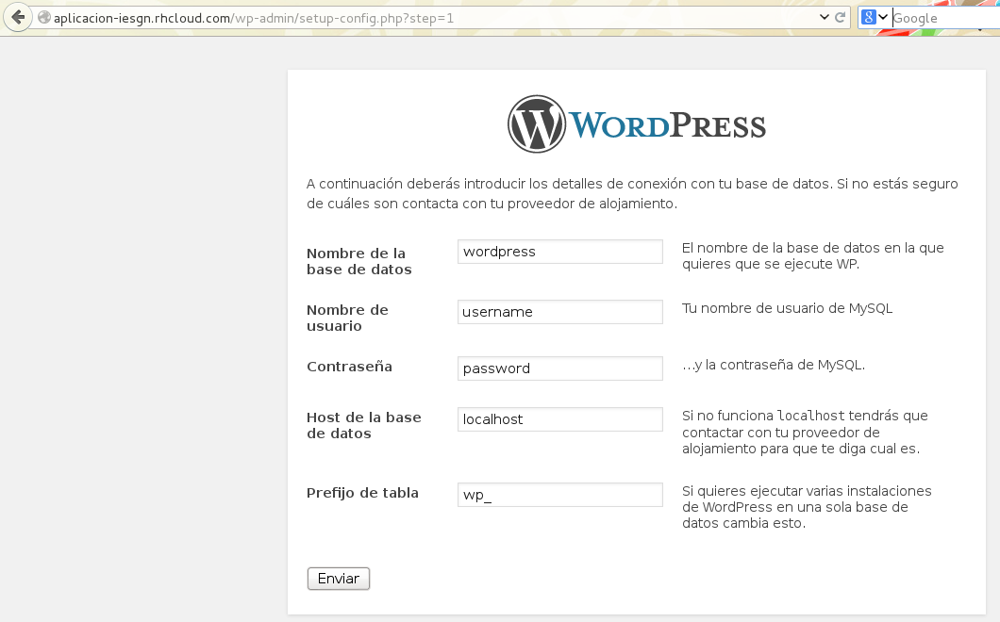

## Instalación de Wordpress usando OpenShift Online

A modo de ejemplo de utilización de OpenShift Online vamos a explicar los pasos
que hay que seguir para desplegar la aplicación web Wordpress en OpenShift
Online utilizando una cuenta gratuita limitada.

### Conceptos previos

* **Gear**: Es un contenedor dentro de una máquina virtual con unos recursos
  limitados para que pueda ejecutar sus aplicaciones un usuario de OpenShift. En
  el caso de utilizar una cuenta gratuita  se pueden crear como máximo tres
  gears de tipo "small", cada uno de ellos puede utilizar un máximo de 512MB de
  RAM, 100MB de swap y 1GB de espacio en disco. Nuestra aplicación se desplegará
  y ejecutará utilizando estos recursos asociados al "gear".
* **Cartridge**: Son contenedores de software preparados para ejecutarse en un
    gear. En principio sobre cada gear pueden desplegarse varios cartridges, por
    ejemplo existen cartridges de php, ruby, jboss, MySQL, django, etc.

### Acceso a OpenShift Online y configuración inicial

Accedemos a la URL [https://www.openshift.com/](https://www.openshift.com/), nos
damos de alta y accedemos con nuestra cuenta. 

Cada cuenta de usuario en OpenShift Online está asociada a un "espacio de
nombres" para generar un FQDN único para cada gear. En la configuración inicial
de la cuenta habrá que seleccionar un espacio de nombres que sea único, este
espacio de nombres se aplicará automáticamente a todos los gears que se
creen. Supongamos a partir de ahora que nuestro espacio de nombres en OpenShift
Online fuese "iesgn" y el primer gear que creásemos tuviera el nombre
"aplicacion", entonces esta aplicación sería accesible a través de la url
http://aplicacion-iesgn.rhcloud.com. 

### Acceso por ssh

Una de las características interesantes que proporciona OpenShift es la
posibilidad de acceder por ssh a la máquina en la que se está ejecutando
nuestra aplicación web, aunque con un usuario con privilegios restringidos.

El acceso remoto a nuestras aplicaciones se hace usando el protocolo SSH. El
mecanismo usado para la autentifcación ssh es usando claves públicas ssh, y es 
necesario indicar las claves públicas ssh que queramos usar para poder acceder
de forma remota. Si no posees un par de claves ssh, puedes generar un par de
claves rsa, usando el siguiente comando: 

    $ ssh-keygen

Por defecto en el direcorio ~/.ssh, se generan la clave pública y la privada:
id_rsa.pub y id_rsa. El contenido del fichero id_rsa.pub es el que tienes que
subir a OpenShift.

### Creando nuestra aplicación

Durante el proceso de creación de una nueva aplicación, tenemos que configurar
los siguientes elementos:

1) Elegir el cartridge (paquete de software) que necesitas para la implantación 
de tu aplicación web. En el caso de WordPress podemos elegir el componente PHP
5.4.

2) Debemos elegir la URL de acceso, teniendo en cuenta el espacio de nombres que
habíamos configurado.

Una vez que se ha creado la aplicación (gear), se nos ofrece información del
repositorio Git que podemos clonar a nuestro equipo local para poder subir los
ficheros al gear. Procedemos a seguir estas instrucciones para clonar el
repositorio remoto de OpenShift en nuestro equipo.

3) Podemos seguir añadiendo nuevos cartridges a nuestro gear, como por ejemplo
añadir el cartridge MySQL 5.5 para ofrecer el servicio de base de datos a
nuestra aplicación.

Como vemos en la imagen nos ofrecen el nombre de usuario y la contraseña del
usuario de mysql. La dirreción IP y el puerto del servidor mysql nos lo ofrece
en una variable de entono del sistema ($OPENSHIFT_MYSQL_DB_HOST y
$OPENSHIFT_MYSQL_DB_PORT).

### Despliegue de wordpress

OpenShift proporciona un gear ya preparado para desplegar wordpress, pero en
esta explicación hemos optado por desplegar wordpress de forma genérica como si
se tratase de una aplicación cualquiera que quisiéramos tener operativa sobre
OpenShift.

Ya tenemos nuestro gear preparado, a continuación nos tenemos que bajar la 
última versión de wordpress y sincronizar los ficheros en nuestro repositorio
git (el repositorio git lo hemos clonado en el directorio *aplicacion*). 

    $ wget http://es.wordpress.org/wordpress-3.9.1-es_ES.zip
    $ unzip wordpress-3.9.1-es_ES.zip
    $ cp -R wordpress/* aplicacion
    $ cd aplicacion 
    ~/aplicacion$ git add *
    ~/aplicacion$ git commit -m "Despliegue inicial de wordpress"
    ~/aplicacion$ git push

Ya podemos acceder a la url http://aplicacion-iesgn.rhcloud.com y terminar el
proceso de instalación.

Tenemos que indicar el nombre de usuario y la contraseña del usuario mysql, el
nombre de la base datos y la ip del servidor de base de datos. Este último dato,
como indicamos anteriormente, lo tenemos guardado en una variable de entono del
sistema, para averiguarlo podemos acceder al gear por ssh y ver las variables
de entorno definidas: 

    ssh 53425534e0b8cd5232000e93@aplicacion-iesgn.rhcloud.com

Otra opción es no usar el asistente de configuración de wordpress, y crear un
fichero wp-config.php donde indicamos los datos de la base de datos usando las
variables predefinidas: 

    ...
    // ** MySQL settings - You can get this info from your web host ** //
    /** The name of the database for WordPress */
    define('DB_NAME', getenv('OPENSHIFT_APP_NAME'));
    
    /** MySQL database username */
    define('DB_USER', getenv('OPENSHIFT_MYSQL_DB_USERNAME'));
    
    /** MySQL database password */
    define('DB_PASSWORD', getenv('OPENSHIFT_MYSQL_DB_PASSWORD'));
    
    /** MySQL hostname */
    define('DB_HOST', getenv('OPENSHIFT_MYSQL_DB_HOST') . ':' . getenv('OPENSHIFT_MYSQL_DB_PORT'));
    
    /** Database Charset to use in creating database tables. */
    define('DB_CHARSET', 'utf8');
    ...

Y posteriormente subirlo al repositorio remoto de OpenShift mediante un commit.

